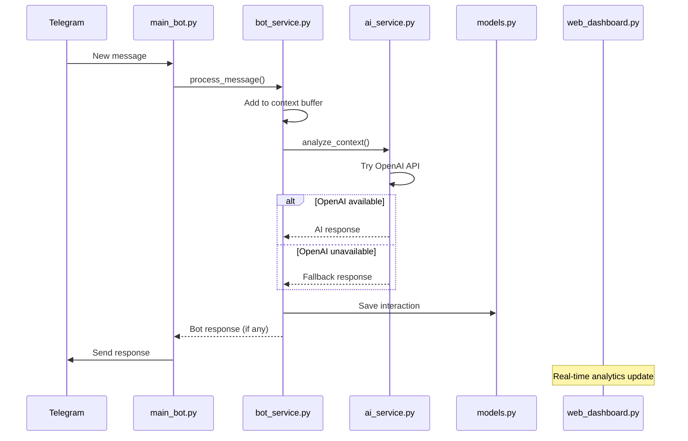
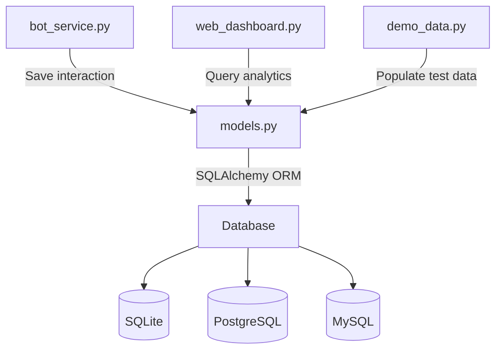
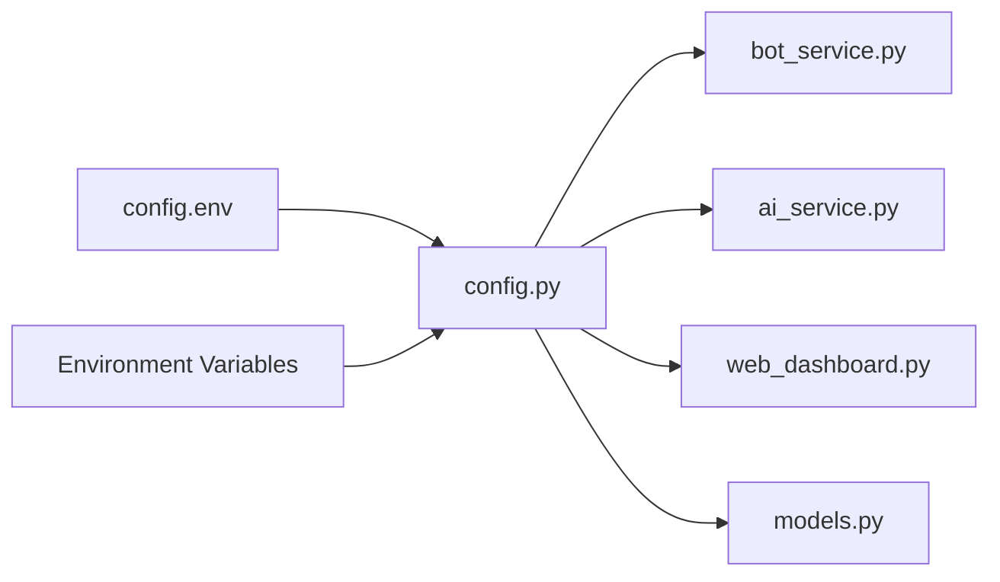

# 🏗️ Архитектура SmartGroupBot

Подробное описание архитектуры, компонентов и принципов проектирования SmartGroupBot.

## 📋 Обзор архитектуры

SmartGroupBot построен на модульной архитектуре с разделением ответственности между компонентами. Система использует асинхронное программирование и event-driven подход.

```
┌─────────────────────────────────────────────────────────┐
│                    SmartGroupBot                        │
│                     Architecture                        │
└─────────────────────────────────────────────────────────┘

┌─────────────────┐    ┌─────────────────┐    ┌─────────────────┐
│   Telegram API  │◄──►│   SmartGroupBot │◄──►│   OpenAI API    │
│    (External)   │    │  (Main System)  │    │   (External)    │
└─────────────────┘    └─────────────────┘    └─────────────────┘
                               │
                               ▼
                       ┌─────────────────┐    ┌─────────────────┐
                       │   SQLAlchemy    │◄──►│   Web Dashboard │
                       │    Database     │    │    (Flask)      │
                       └─────────────────┘    └─────────────────┘
```

## 🏛️ Основные принципы

### 1. **Модульность**
- Каждый компонент имеет чётко определённую ответственность
- Слабая связанность между модулями
- Лёгкая замена и тестирование компонентов

### 2. **Асинхронность**
- Использование `asyncio` для неблокирующих операций
- Обработка множественных запросов одновременно
- Эффективное использование ресурсов

### 3. **Отказоустойчивость**
- Graceful degradation при недоступности внешних API
- Fallback механизмы для всех критических операций
- Comprehensive error handling

### 4. **Масштабируемость**
- Горизонтальное масштабирование через Docker
- Поддержка различных баз данных
- Настраиваемая конфигурация

## 🧩 Компоненты системы

### 🤖 main_bot.py - Главный модуль
```python
┌─────────────────────────────────────┐
│            main_bot.py              │
├─────────────────────────────────────┤
│ • Application startup              │
│ • Event handlers registration      │
│ • Graceful shutdown               │
│ • Error handling & recovery       │
│ • Logging coordination           │
└─────────────────────────────────────┘
```

**Ответственность:**
- Инициализация всех компонентов
- Регистрация обработчиков событий
- Координация работы системы
- Обработка системных сигналов

**Ключевые методы:**
```python
class SmartGroupBot:
    async def start(self) -> None
    async def stop(self) -> None
    async def handle_message(self, update, context) -> None
    async def handle_command(self, update, context) -> None
```

---

### 📡 telegram_bot.py - Telegram интеграция
```python
┌─────────────────────────────────────┐
│          telegram_bot.py            │
├─────────────────────────────────────┤
│ • Telegram API wrapper            │
│ • Message formatting              │
│ • Chat management                 │
│ • User permissions               │
│ • Rate limiting                  │
└─────────────────────────────────────┘
```

**Ответственность:**
- Абстракция Telegram Bot API
- Форматирование сообщений
- Управление правами пользователей
- Rate limiting для API вызовов

**Основные классы:**
```python
class TelegramBot:
    async def send_message(self, chat_id: str, text: str) -> bool
    async def get_chat_info(self, chat_id: str) -> Dict
    async def check_permissions(self, user_id: str) -> bool
```

---

### 💼 bot_service.py - Бизнес логика
```python
┌─────────────────────────────────────┐
│           bot_service.py            │
├─────────────────────────────────────┤
│ • Message processing pipeline     │
│ • Context management             │
│ • Response frequency control     │
│ • Database interactions          │
│ • Analytics collection           │
└─────────────────────────────────────┘
```

**Ответственность:**
- Основная бизнес логика обработки сообщений
- Управление контекстом разговора
- Контроль частоты ответов
- Сохранение аналитики

**Workflow:**
```python
async def process_message(self, chat_id, message) -> Optional[str]:
    # 1. Добавление в буфер контекста
    # 2. Проверка минимального количества сообщений
    # 3. AI анализ контекста
    # 4. Проверка частоты ответов
    # 5. Генерация ответа (если нужно)
    # 6. Сохранение в базу данных
    # 7. Возврат ответа
```

---

### 🧠 ai_service.py - AI сервис
```python
┌─────────────────────────────────────┐
│            ai_service.py            │
├─────────────────────────────────────┤
│ • OpenAI API integration          │
│ • Fallback response system        │
│ • Context analysis               │
│ • Sentiment analysis             │
│ • Topic detection               │
└─────────────────────────────────────┘
```

**Ответственность:**
- Интеграция с OpenAI GPT
- Анализ контекста и генерация ответов
- Fallback режим при недоступности OpenAI
- Анализ настроений и тем

**AI Pipeline:**
```python
async def analyze_context_and_generate_response(
    self, context_messages: List[str]
) -> Dict:
    try:
        # 1. Попытка использования OpenAI
        result = await self._openai_analysis(context_messages)
    except Exception:
        # 2. Fallback на локальный анализ
        result = self._get_fallback_response(context_messages)
    
    return {
        "detected_topic": str,
        "sentiment": float,
        "should_respond": bool,
        "response": Optional[str]
    }
```

---

### 🗄️ models.py - Модели данных
```python
┌─────────────────────────────────────┐
│             models.py               │
├─────────────────────────────────────┤
│ • SQLAlchemy models              │
│ • Database schema               │
│ • Migration management          │
│ • Data validation              │
│ • Indexing & optimization       │
└─────────────────────────────────────┘
```

**Схема базы данных:**
```sql
CREATE TABLE chat_interactions (
    id              INTEGER PRIMARY KEY,
    timestamp       DATETIME NOT NULL,
    chat_id         VARCHAR(50) NOT NULL,
    chat_title      VARCHAR(255),
    context_messages JSON NOT NULL,
    detected_topic  VARCHAR(255),
    sentiment       FLOAT,
    bot_response    TEXT,
    response_generated BOOLEAN,
    participants_count INTEGER
);

-- Индексы для оптимизации
CREATE INDEX idx_chat_id_timestamp ON chat_interactions(chat_id, timestamp);
CREATE INDEX idx_timestamp ON chat_interactions(timestamp);
CREATE INDEX idx_detected_topic ON chat_interactions(detected_topic);
```

---

### 🌐 web_dashboard.py - Веб интерфейс
```python
┌─────────────────────────────────────┐
│         web_dashboard.py            │
├─────────────────────────────────────┤
│ • Flask web application           │
│ • REST API endpoints             │
│ • Real-time analytics            │
│ • Chart.js visualizations        │
│ • Responsive UI                  │
└─────────────────────────────────────┘
```

**API Endpoints:**
- `GET /` - Главная страница панели
- `GET /api/stats` - Общая статистика
- `GET /api/chats` - Список чатов
- `GET /api/interactions` - История взаимодействий
- `GET /api/analytics/sentiment` - Анализ настроений
- `POST /api/chat/{id}/simulate` - Симуляция сообщений

---

### ⚙️ config.py - Конфигурация
```python
┌─────────────────────────────────────┐
│             config.py               │
├─────────────────────────────────────┤
│ • Environment variables loading   │
│ • Configuration validation        │
│ • Settings management            │
│ • Type conversion               │
│ • Default values               │
└─────────────────────────────────────┘
```

**Конфигурационные группы:**
- Telegram Bot settings
- OpenAI API configuration  
- Database connection
- Web dashboard settings
- Logging configuration

---

## 🔄 Взаимодействие компонентов

### Message Processing Flow


### Database Interaction


### Configuration Loading


## 🔧 Технические решения

### 1. **Асинхронная архитектура**
```python
# Использование asyncio для неблокирующих операций
class BotService:
    async def process_message(self, message: str) -> Optional[str]:
        # Асинхронный вызов AI сервиса
        result = await ai_service.analyze_context_and_generate_response(
            context_messages
        )
        # Асинхронное сохранение в БД
        await database.save_interaction(result)
        return result.get('response')
```

### 2. **Dependency Injection**
```python
class SmartGroupBot:
    def __init__(self):
        # Инъекция зависимостей через конфигурацию
        self.bot_service = BotService(config)
        self.ai_service = AIService(config)
        self.database = DatabaseManager(config.database_url)
```

### 3. **Error Handling Strategy**
```python
# Многоуровневая обработка ошибок
try:
    response = await openai_client.create_completion(...)
except openai.RateLimitError:
    # Использование fallback режима
    response = fallback_generator.generate_response(...)
except Exception as e:
    # Логирование и graceful degradation
    logger.error(f"AI service error: {e}")
    return None
```

### 4. **Caching Strategy**
```python
# Кэширование контекста сообщений
class ContextBuffer:
    def __init__(self, max_size: int = 100):
        self._buffer: Dict[str, deque] = {}
        self._max_size = max_size
    
    def add_message(self, chat_id: str, message: str):
        if chat_id not in self._buffer:
            self._buffer[chat_id] = deque(maxlen=self._max_size)
        self._buffer[chat_id].append(message)
```

## 📊 Мониторинг и метрики

### Logging Architecture
```python
┌─────────────────────────────────────┐
│            Logging Stack            │
├─────────────────────────────────────┤
│ Application Logs → loguru           │
│ HTTP Requests → Flask logging       │
│ Database Queries → SQLAlchemy logs  │
│ Telegram API → httpx logs          │
│ OpenAI API → openai logs           │
└─────────────────────────────────────┘
```

### Metrics Collection
- **Response Rate:** percentage of messages that get bot responses
- **Processing Time:** time to analyze and respond to messages
- **API Usage:** OpenAI token consumption and rate limits
- **Database Performance:** query execution times
- **Error Rates:** exceptions and fallback usage

## 🚀 Масштабирование

### Horizontal Scaling
```yaml
# docker-compose.scale.yml
version: '3.8'
services:
  bot:
    image: smartgroupbot:latest
    deploy:
      replicas: 3
  
  db:
    image: postgres:13
    deploy:
      replicas: 1
  
  dashboard:
    image: smartgroupbot-dashboard:latest
    deploy:
      replicas: 2
```

### Load Balancing
- **Bot instances:** Multiple bot processes with shared database
- **Dashboard:** Load balancer для веб-панели
- **Database:** Master-slave репликация для читающих запросов

### Performance Optimizations
1. **Connection Pooling:** SQLAlchemy connection pool
2. **Async I/O:** Non-blocking HTTP requests
3. **Message Batching:** Group database writes
4. **Caching:** In-memory context and analytics cache

## 🔒 Безопасность

### Authentication & Authorization
```python
# Middleware для проверки прав доступа
class AuthMiddleware:
    async def check_user_permissions(self, user_id: str) -> bool:
        # Проверка прав пользователя
        return user_id in allowed_users
```

### Data Protection
- **Token Security:** Environment variables only
- **Database Security:** Parameterized queries
- **Input Validation:** Pydantic models for data validation
- **Rate Limiting:** Protection against spam

### Privacy
- **Data Anonymization:** Hash sensitive user data
- **Retention Policy:** Automatic cleanup of old data
- **GDPR Compliance:** User data deletion endpoints

## 🧪 Testing Architecture

### Test Structure
```
tests/
├── unit/                 # Unit tests
│   ├── test_ai_service.py
│   ├── test_bot_service.py
│   └── test_models.py
├── integration/          # Integration tests
│   ├── test_telegram_api.py
│   └── test_database.py
└── e2e/                 # End-to-end tests
    └── test_bot_workflow.py
```

### Test Strategies
- **Unit Tests:** Mock external dependencies
- **Integration Tests:** Real database, mocked APIs
- **E2E Tests:** Full system with test Telegram bot

## 🔄 Future Enhancements

### Planned Architecture Improvements
1. **Microservices:** Split into separate services
2. **Message Queue:** Redis/RabbitMQ for async processing
3. **Event Sourcing:** Store all events for audit trail
4. **GraphQL API:** More flexible API for dashboard
5. **Machine Learning:** Custom models for better responses

### Plugin Architecture
```python
# Будущая plugin система
class PluginManager:
    def register_plugin(self, plugin: BasePlugin):
        # Регистрация плагинов
        pass
    
    async def process_with_plugins(self, message: str) -> str:
        # Обработка через все плагины
        pass
```

---

**📚 Дополнительно:** 
- [API Документация](api.md) - Подробности REST API
- [Конфигурация](configuration.md) - Настройка системы
- [Установка](installation.md) - Деплой и установка 